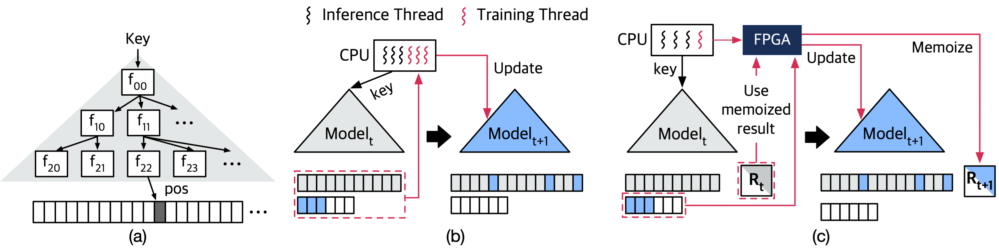

# SIA



**SIA**: **S**tring-key **l**earned Index **A**cceleration is an algorithm-hardware co-designed string-key learned index system for efficient and scable indexing. Unlike traditional data structures such as trees or hash tables, learned indexes employ machine learning models. One type of learned index, Recursive Model Index (RMI), infers the position of the key by constructing machine learning models ($f_{00}, f_{10}, ...$) into a hierarchical structure as depicted in *Figure (a)* above. However, existing learned index systems (*Figure (b)*) face performance bottleneck due to simultaneous CPU model inference and training.

To mitigate this bottleneck, SIA exploits memoization technique to reduce the cost of retraining for inserted keys. This solution utilizes the algorithmic characteristics of matrix decomposition and can be applied to updatable learned indexes based on linear regression models. Also, SIA offloads model training to a dedicated FPGA accelerator, allowing model training to be accelerated and CPU resources to be focused on model inference and query processing. The concept of SIA is shown in *Figure (c)* above.

This repository contains the full implementation of SIA-SW, FPGA accelerator kernel of SIA-HW written in Chisel3, and CPU-FPGA interface code for Intel Harp system. Our implementaion is based on the previous work, SIndex[^1] (https://ipads.se.sjtu.edu.cn:1312/opensource/xindex/-/tree/sindex/).

[^1]: Youyun Wang, Chuzhe Tang, Zhaoguo Wang, and Haibo Chen. 2020. SIndex: A Scalable Learned Index for String Keys. In Proceedings of the 11th ACM SIGOPS Asia-Pacific Workshop on Systems (Tsukuba, Japan) (APSys ’20).


## Directory structure

- `original`: Original version of SIndex with no modification.
- `ideal`: Idealized version of SIndex that emulates the system with no training cost.
- `sia-sw`: CPU-only SIA.
- `sia-hw`: FPGA accelerated SIA.
- `alex`: string & multi-threaded ALEX.
- `sia-accelerator/src`: FPGA accelerator code written in Chisel3.
- `sia-accelerator/intel`: FPGA-CPU interface for Intel Harp platform.
- `dataset/preprocessing`: Scripts for preprocessing dataset
- `scripts`: Scripts for reproducing evaluation results


## Prerequisites

Intel MKL library is required to build this project. Follow the commands below to install the library.


```sh
$ cd /tmp
$ wget https://apt.repos.intel.com/intel-gpg-keys/GPG-PUB-KEY-INTEL-SW-PRODUCTS-2019.PUB
$ apt-key add GPG-PUB-KEY-INTEL-SW-PRODUCTS-2019.PUB
$ rm GPG-PUB-KEY-INTEL-SW-PRODUCTS-2019.PUB

$ sh -c 'echo deb https://apt.repos.intel.com/mkl all main > /etc/apt/sources.list.d/intel-mkl.list'
$ apt-get update
$ apt-get install -y intel-mkl-2019.0-045
```


## Clone

Clone this repository including baseline indexes ([cuckoo-trie](https://github.com/cuckoo-trie/cuckoo-trie-code) and [wormhole](https://github.com/wuxb45/wormhole)).

```shell
$ git clone --recursive https://github.com/sia-index/sia.git
```


## Download & Preprocess Dataset

### Amazon Review Dataset

You can download [Amazon review dataset](https://cseweb.ucsd.edu/~jmcauley/datasets/amazon_v2/)[^2] with the following commands. Downloaded dataset will be placed in `dataset/raw_dataset` directory.

```shell
$ cd dataset/raw_dataset
$ wget https://datarepo.eng.ucsd.edu/mcauley_group/data/amazon_v2/categoryFilesSmall/all_csv_files.csv
```

You can preprocess the downloaded Amazon review dataset with the script in `dataset/preprocessing` directory. 

```shell
$ cd dataset/preprocessing
$ python3 amazon_convert.py ../amazon
```

Preprocessed dataset will be prepared in `dataset/amazon` directory.

[^2]: Jianmo Ni, Jiacheng Li, and Julian McAuley. 2019. Justifying Recommendations using Distantly-Labeled Reviews and Fine-Grained Aspects. In Proceedings of the 2019 Conference on Empirical Methods in Natural Language Processing and the 9th International Joint Conference on Natural Language Processing (EMNLP-IJCNLP).


### MemeTracker Dataset

You can download [MemeTracker dataset](https://snap.stanford.edu/data/memetracker9.html)[^3] with the following commands. The dataset consists of multiple files, so you can download a few of them. Downloaded dataset files will be placed in `dataset/raw_dataset` directory.

```shell
$ cd dataset/raw_dataset
$ wget https://snap.stanford.edu/data/bigdata/memetracker9/quotes_2008-12.txt.gz
$ wget https://snap.stanford.edu/data/bigdata/memetracker9/quotes_2009-01.txt.gz
$ wget https://snap.stanford.edu/data/bigdata/memetracker9/quotes_2009-02.txt.gz
$ wget https://snap.stanford.edu/data/bigdata/memetracker9/quotes_2009-03.txt.gz
$ wget https://snap.stanford.edu/data/bigdata/memetracker9/quotes_2009-04.txt.gz
$ gzip -d quotes_200* -v
```

You can preprocess the downloaded MemeTracker dataset files with the script in `dataset/preprocessing` directory. You can specify the list of downloaded files in `file_list ` list in this script `memetracker_convert.py`.

```shell
$ cd dataset/preprocessing
$ python3 memetracker_convert.py ../memetracker
```

Preprocessed dataset will be preprared in `dataset/memetracker` directory.

[^3]: Jure Leskovec, Lars Backstrom, and Jon Kleinberg. 2009. Meme-Tracking and the Dynamics of the News Cycle. In Proceedings of the 15th ACM SIGKDD International Conference on Knowledge Discovery and Data Mining (Paris, France) (KDD ’09).


### Twitter Cache Trace

Since [Twitter Cache Trace dataset](https://github.com/twitter/cache-trace)[^4] is very huge dataset, you can selectivly use partitioned trace file, as in our paper *(e.g., 12.2, 15.5, 31.1, 37.3)*. You can find and download Twitter Cache Trace in the following links. 

| Cluster Number | Link                                         |
| -------------- | -------------------------------------------- |
| Cluster12      | http://iotta.snia.org/traces/key-value/29954 |
| Cluster15      | http://iotta.snia.org/traces/key-value/30383 |
| Cluster31      | http://iotta.snia.org/traces/key-value/32834 |
| Cluster37      | http://iotta.snia.org/traces/key-value/33470 |

You can preprocess the download Twitter Cache traces with the script in `dataset/preprocessing` directory. You should specify **cluster number**, **path to the download trace**, and **path to save the preprocessed dataset**. Please refer to the following example commands to learn how to use this script.

```shell
$ cd dataset/raw_dataset
$ zstd -d cluster*.zst -v
$ cd ../preprocessing
$ python3 twitter_convert.py 12.2 ../raw_dataset/cluster12.002 ../twitter
$ python3 twitter_convert.py 15.5 ../raw_dataset/cluster15.005 ../twitter
$ python3 twitter_convert.py 31.1 ../raw_dataset/cluster31.001 ../twitter
$ python3 twitter_convert.py 37.3 ../raw_dataset/cluster37.003 ../twitter
```

Preprocessed dataset will be prepared in `dataset/twitter` directory.

[^4]: Juncheng Yang, Yao Yue, and K. V. Rashmi. 2020. A Large Scale Analysis of Hundreds of In-Memory Cache Clusters at Twitter. In Proceedings of the 14th USENIX Conference on Operating Systems Design and Implementation (OSDI’20).


## Build & Configuration

To build this project, you need CMake (> 3.5) and g++ (supports c++14) installed on your system. Follow the command below to build this project. It will take a lot of time since it generates a large number of executable files. If your machine supports multi-core, use `make -j` option to specify the number of cores to use and compile multiple executables simulatenously.

```sh
$ cd build
$ cmake ..
$ make -j 16
```

You can specify the list of **benchmark** and **length of the key** to use in `CMakeLists.txt`.
```cmake
# @CMakeLists.txt: 27
list(APPEND BenchList ycsb ycsb twitter twitter twitter twitter)
list(APPEND KeyList   12   128  44      19      47      82)
```

Also, you can specify the list of **query_distribution** to use in `CMakeLists.txt`.

```cmake
# @CMakeLists.txt: 72
list(APPEND DistList UNIFORM_DIST SEQUENTIAL_DIST LATEST_DIST EXPONENTIAL_DIST ZIPF_DIST HOTSPOT_DIST)
```


## Single Run

To run YCSB benchmark, you can use the following script. You should specify the name of the **dataset** and **workload type**. You can choose one of the key lengths you set when building this project *(e.g., 12, 128)*, too.

```shell
$ ./build/PERFORMANCE_sia-sw_ycsb_{KEY_LENGTH} 					\
	--fg={NUMBER OF FG THREADS}									\
	--runtime={INDEX RUNNING TIME} 								\
	--dataset-name={NAME OF DATASET e.g. amazon, memetracker} 	\
	--workload-type={YCSB WORKLOAD TYPE e.g. D, E}
```

To run Twitter Cache Trace, you can use the following script. You should specify the trace **cluster number**. You can choose one of the key lengths you set when building this project *(e.g., 44, 19, 47, 82)*, too.

```shell
$ ./build/PERFORMANCE_sia-sw_twitter_{KEY_LENGTH} 				\
	--fg={NUMBER OF FG THREADS}									\
	--runtime={INDEX RUNNING TIME}  							\
	--cluster-number={CLUSTER NUMBER e.g. 12.2, 15.5, 31.1, 37.3}
```

To run microbenchmark, you can use the following script. It will generate random string key with uniform distribution. You can choose one the of **query distribution** you set when building this project *(e.g., UNIFORM_DIST, SEQUENTIAL_DIST, LATEST_DIST, EXPONENTIAL_DIST, ZIPF_DIST, HOTSPOT_DIST)*

```sh
$ ./build/PERFORMANCE_sia-sw_bench_{DISTRIBUTION} 				\
	--fg={NUMBER OF FG THREADS} 								\
	--read={READ QUERY RATIO}									\
	--insert={INSERT QUERY RATIO}								\
	--update={UPDATE QUERY RATIO}								\
	--remove={REMOVE QUERY RATIO}								\
	--scan={RANGE QUERY RATIO}									\
	--runtime={INDEX RUNNING TIME}								\
	--initial-size={NUMBER OF INITIALLY INSERTED KEYS} 			\
	--target-size={FINAL NUMBER OF ENTIRE KEYS} 				\
	--table-size={NUMBER OF KEYS IN THE DATASET}
```

For all the above commands, you can use `original`, `sia-hw`, and `ideal` instead of `sia-sw`.


## Reproducible Scripts

All results generated with the following scripts will be export in the format of `.csv` file.

You can edit the list of **index** *(e.g. original, sia-sw, ideal, wormhole, cuckoo, alex)*, **YCSB dataset** *(e.g. amazon, memetracker)*, **YCSB workload** *(e.g. D, E)*, and **Twitter Cache Trace number** *(e.g. 12.2, 15.5, 31.1, 37.3)* at the beginning of the Python scripts. You can also specifiy the **number of times you want to repeat** the experiment. The exported result is the average of the entire trial.

### Throughput & Latency Measurement

This script measures the performance (**throughput**, **latency**) of the indexes for various workloads and datasets with YCSB and Twitter Cache Trace. 

This script will generate two result file `performance_ycsb.csv` and `performance_twitter.csv` which contain the results corresponding to the Figure 12 of the paper.

```shell
$ cd scripts
$ python3 performance.py
```


### Query  Latency - Latency Breakdown

This script measures the average latency of each sub-operations (**tree traverse, ML inference, local search, range scan, buffer search**) and gets the latency breakdown result.

This script will generate two result file `latency_breakdown_ycsb.csv` and `latency_breakdown_twitter.csv`, which contain the results corresponding to the Figure 13 of the paper.

```shell
$ cd scripts
$ python3 latency_breakdown.py
```


### Implication of Request Distributions

This script measures the performance (**throughput, latency**) of the indexes for various query distribution(**Sequential, Zipfian, Hotspot, Exponent, Uniform, Latest**) with microbenchmark generating uniform distributed string keys. 

This script will generate a result file `request_dist.csv`, which contains the results corresponding to the Figure 17 of the paper.

```shell
$ cd scripts
$ python3 request_dist.py 
```


### Implication of Lazy Delete Query Handling

This experiment can only be done in `ideal`. To evaluate the implication of lazy deletion, we implemented a ideal learned index named `ideal` and measured its performance. This index assumes that the ML model can be trained at zero-cost, and eventually updates its ML models at specified time interval. When deletion is performed in this index, memoized R matrices for the deleted keys are not processed for a specified time interval due to lazy deletion, and is eventuall processed, and we can see the implication of this scheme on the performance. This script sweeps the **deletion ratio** (from 5% to 15%) and **training interval** (5, 30, 100, 300 sec) and measure the performance (**throughput, latency**).

This script will generate a result file `lazy_delete.csv`, which contains the results corresponding to the Table 2 of the paper.

```shell
$ cd scripts
$ python3 lazy_delete.py
```


### Implication of Node Size on Throughput

This script measures the performance (**throughput, latency**) of the indexes for various node sizes (**THR, 3/4 THR, 2/4 THR, 1/4 THR**). The size of the nodes can be adjusted by chaning the accruacy threshold of the ML model, and this script also exploits this fact.

This script will generate two result file `node_size_ycsb.csv`  and `node_size_twitter.csv`, which contain the results corresponding to the Figure 18 of the paper.

```shell
$ cd scripts
$ python3 node_size.py
```


## Compile Chisel3 FPGA Code

You need to install [scala](https://www.scala-lang.org/download/) & [sbt](https://www.scala-sbt.org/download.html) to compile Chisel3 code into Verilog code.

```sh
$ echo "deb https://repo.scala-sbt.org/scalasbt/debian all main"
	| sudo tee /etc/apt/sources.list.d/sbt.list
$ echo "deb https://repo.scala-sbt.org/scalasbt/debian /"
	| sudo tee /etc/apt/sources.list.d/sbt_old.list
$ curl -sL "https://keyserver.ubuntu.com/pks/lookup?op=get&search=0x2EE0EA64E40A89B84B2DF73499E82A75642AC823"
	| sudo apt-key add
$ sudo apt-get update
$ sudo apt-get install sbt
$ curl -fL https://github.com/coursier/coursier/releases/latest/download/cs-x86_64-pc-linux.gz
	| gzip -d
	> cs
	&& chmod +x cs
	&& ./cs setup
```

To compile Chisel3 code, type the following:

```sh
$ cd sia-accelerator
$ sbt run
```

Select `1`, if you encounter the following menu:

```shell
>>> Multiple main classes detected. Select one to run:
[1] QRD_Unit
...

Enter number: 1
```

It will compile Chisel3 code and generate Verilog code. Output Verilog code will be generated in the `sia-accelerator/generated` directory.


## CPU-FPGA Environment

CPU-FPGA interface code is written for Intel Harp system.

For the SW interface code, [OPAE SDK](https://opae.github.io/) is required to be build.

For the HW interface & accelerator wrapper, [Intel FPGA BBB](https://github.com/OPAE/intel-fpga-bbb) library is required to synthesize the FPGA kernel.

Quartus II v20.1 is used to synthesize the entire HW-side FPGA kernel, interface, and accelerator wrapper.

After compiling Chisel3 codes, enter the following commands that will copy compiled Verilog codes from Chisel3 code into `intel/src` directory.

```shell
$ cd sia-accelerator/intel/src
$ ./copy_generated_rtl.sh ../../generated
```

The following command will synthesize the target accelerator, and also host-FPGA interface with Quartus II installed in the machine. (Environment variable may need to be modified, please refer to OPAE SDK repository or scripts installed with Quartus II.)

```shell
$ cd sia-accelerator/intel/testbench/qrd_unit
$ ./synth.sh
```